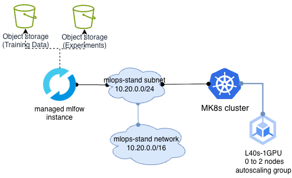
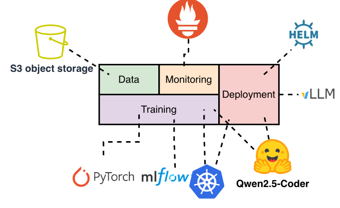

# Nebius AI Cloud MLOps Reference Architecture: Multi-Adapter LoRA Serving with vLLM

An end-to-end, declarative MLOps reference architecture and demo stand deployed entirely via Terraform on Nebius AI Cloud. This architecture addresses multi-tenant LLM serving economics by combining Kubernetes for scheduling jobs, Self-Hosted MLflow on MK8s experiment tracking, and dynamic multi-adapter serving via vLLM on NVIDIA L40S GPUs.

---

## 1. Project Overview

This reference architecture provisions an automated, production-ready MLOps platform on Nebius AI Cloud designed for multi-tenant Large Language Model serving. The platform executes automated QLoRA batch fine-tuning jobs on NVIDIA L40S GPUs and serves the resulting adapters via a unified vLLM inference engine capable of dynamic, zero-downtime LoRA swapping via HTTP request headers. By decoupling base model weights from task-specific parameter deltas, the architecture eliminates dedicated cluster sprawl, reduces inference GPU costs, and centralizes experiment tracking and observability across the lifecycle. The entire stack - Nebius Managed Kubernetes (MK8s), VPC networking, S3 Object Storage, self-hosted MLflow tracking backed by PostgreSQL, Prometheus Operator, and Grafana performance dashboards—is provisioned and managed declaratively via Terraform and Kubernetes manifests.


---

## 2. Architecture and quota/resource requirements



- Kubernetes cluster: 1 node GPU (minimum configuration H100/H200/L40S), 2 node CPU only 2CPU-8RAM-100GB
- S3 Bucket with 100MB minimum (or unlimited)

## 3. Tech stack



## 4. Repository Structure

```text
├── docs/
│   └── architecture.png 
├── terraform/
│   ├── network.tf                   
|   ├── kubernetes.tf
│   ├── s3-storage.tf
│   ├── terraform.tf
│   ├── providers.tf
└── k8s/
    ├── training/
    └── app/
```

---

## 5. Deployment Prerequisites

* **Nebius CLI:** Installed and authenticated (`nebius auth login`).
* **Terraform:** `>= 1.5.0`.
* **Kubectl & Helm:** Installed locally (`kubectl >= 1.28`, `helm >= 3.12`).
* **IAM Permissions:** Project Editor or equivalent permissions on the target Nebius container/folder.

---

## 6. Step-by-Step Installation

### Step 1: Provision Infrastructure via Terraform

Clone the repository and initialize the Terraform state:

```bash
git clone https://github.com/IlyaNyrkov/nebius-llm-finetuning-demo-stand.git
cd nebius-llm-finetuning-demo-stand
```

Set nebius access token to use terraform.
```bash
export NEBIUS_IAM_TOKEN=$(nebius iam get-access-token)
```

Initialize terraform

```bash
cd terraform
```

```bash
terraform init
```

Before applying, check availability of CPU models and GPU models in your region in Web UI or using cli command. Any CPU and GPU model will work.

```bash
# tenant_ID is one level higher than project_ID
nebius capacity resource-advice list --parent-id <tenant_ID>
```

In case if it is not available specify other values in terraform/

```bash
terraform apply --auto-approve
```

### Step 2: Configure Cluster Access & Storage Secrets

Retrieve the cluster credentials using the Nebius CLI and extract output endpoints:

```bash
# Record ID of a cluster created by Terraform 
CLUSTER_ID=$(nebius mk8s cluster list --format json | jq -r '.items[] | select(.metadata.name == "mlops-stand-k8s") | .metadata.id'
)

# Export kubeconfig for external access
nebius mk8s cluster get-credentials --id ${CLUSTER_ID} --external

# Verify cluster connectivity and GPU worker nodes
kubectl get nodes -o wide
```

Create K8s secret for access to nebius S3 from pods.

```bash
kubectl create secret generic nebius-storage-creds \
  --from-literal=AWS_ACCESS_KEY_ID=$(terraform output -raw storage_access_key_id) \
  --from-literal=AWS_SECRET_ACCESS_KEY=$(terraform output -raw storage_secret_key) \
  --namespace=default
```

Create a copy of a secret (or generate another s3 access key and k8s secret) for mlflow in monitoring namespace.

```bash
kubectl get secret nebius-storage-creds -n default -o yaml \
  | grep -v '^\s*namespace:\s' \
  | kubectl apply --namespace=monitoring -f -
```

Secret cannot be used from different namespace. vLLM app is deployed in separate namespace from MLFLOW and requires s3 access to load trained LORA adapter.


### Step 3: Install & Configure MLflow

Managed Mlflow in Nebius can also be used, depending on service's availability in a project's region.

Add bitnami helm repository

```bash
helm repo add bitnami https://charts.bitnami.com/bitnami
helm repo update
```

Install PostgreSQL into the monitoring namespace. Other Database name and user credits can be specified. They must match ones specified for mlflow deployment in k8s/mlflow-values.yml

```bash
helm install mlflow-db bitnami/postgresql \
  --namespace monitoring \
  --set auth.username=mlflow \
  --set auth.password=mlflow123 \
  --set auth.database=mlflow \
  --set primary.persistence.size=10Gi
```

Install MLflow using k8s/mlflow-values.yml configuration 

```bash
helm repo add community-charts https://community-charts.github.io/helm-charts

helm repo update

helm install mlflow community-charts/mlflow \
  --namespace monitoring \
  -f k8s/mlflow-values.yml
```

Mlflow UI can be accessed via service ip

```bash
kubectl get svc mlflow -n monitoring -o json | jq -r '.status.loadBalancer.ingress[0].ip'
```

```bash
http://<EXTERNAL_IP>:5000
```

### Step 4 (Optional): Install Monitoring Aplications from Nebius marketplace

1. Go to Nebius Web UI
2. Choose Compute -> Kubernetes -> mlops-stand-k8s
3. On mlops-stand-k8s kubernetes cluster page to Applications
4. Install Prometheus Operator
    1. Name: Mlops-prometheus-operator
    2. Namespace: monitoring 
    3. Hit Deploy application
5. Install Grafana solution by Nebius
    1. Name: Mlops-Grafana
    2. Namespace: Monitoring
    3. Service account: k8s-jobs-sa (or create new service account)
    4. Save generated password
    5. Hit Deploy application

### Step 5: Execute Batch Fine-Tuning Job

Trigger the PyTorch LoRA fine-tuning Job on the GPU node pool. The Job pulls the training dataset slice, runs PEFT, streams loss/eval curves to MLflow, and saves the adapter weights:

```bash
kubectl apply -k k8s/training/overlays/sql-expert

# Follow training logs in real time
kubectl logs -f jobs/llm-lora-finetune-sql-expert -c trainer
```

During job execution mlflow experiment will be available for viewing in mlfow interface. Model training and GPU performance can be viewed.

After training results will be stored in S3 bucket created via terraform earlier.


### Step 6: Deploy vLLM Multi-Adapter Serving Engine

Deploy vLLM configured with `--enable-lora` and pre-load adapter references via Helm:

```bash
kubectl apply -f k8s/app
```

Wait until the vLLM pod is in `Running` state and the base model is warmed in VRAM:

```bash
kubectl wait --for=condition=ready pod -l app.kubernetes.io/name=vllm --timeout=600s
```

To view metrics from deployed vLLM service in Grafana deploy vllm service monitor.

```bash
kubectl apply -f k8s/vllm-service-monitor.yml
```
---

## 7. Live Demonstration Walkthrough

### 1. Verification of Base Model Inference

Send a prompt to the base model (`meta-llama/Llama-3.1-8B-Instruct` or `Qwen/Qwen2.5-Coder-7B-Instruct`) **without** adapter modification:

```bash
INGRESS_IP=$(kubectl get svc vllm-service -o jsonpath='{.status.loadBalancer.ingress[0].ip}')

curl -s http://${INGRESS_IP}/v1/chat/completions \
  -H "Content-Type: application/json" \
  -d '{
    "model": "Qwen/Qwen2.5-Coder-7B-Instruct",
    "messages": [
      {"role": "user", "content": "How do I query all active users from a database?"}
    ],
    "temperature": 0.0
  }' | jq '.choices[0].message.content'

```

*Expected Output:* Conversational, natural-language explanation covering general SQL syntax and conceptual tips.

---

### 2. Live Dynamic LoRA Swap

Send the same request specifying the registered LoRA adapter name. vLLM loads the adapter weights dynamically into remaining VRAM without restarting the engine or dropping connections:

```bash
curl -s http://${INGRESS_IP}/v1/chat/completions \
  -H "Content-Type: application/json" \
  -d '{
    "model": "sql-expert-lora",
    "messages": [
      {"role": "user", "content": "How do I query all active users from a database?"}
    ],
    "temperature": 0.0
  }' | jq '.choices[0].message.content'

```

*Expected Output:* Strictly formatted, deterministic, schema-compliant SQL query with production indexing hints, demonstrating domain specialization.

---

### 3. Observability & Tracking Metrics

* **MLflow UI:** . Review training epochs, training loss vs. evaluation loss, and the registered adapter artifact lineage.


* **vLLM Metrics:** View Prometheus metrics on the vLLM service in Grafana using grafana_dashboards folder:
    * concurrency_queue_depth.json
    * kv_cache_usage.json
    * p95_end_to_end_latency.json
    * token_throughput.json


To upload grafana dashboards:
<grafana admin password\> - password created earlier during application installation.

<grafana URI\> - uri that can be viewed in nebius Web UI on application page. Specify without protocol e.g. "grafana-s9wwgezcczf.tunnel.applications.eu-west1.nebius.cloud".

```bash
./upload_grafana_dashboards.sh <grafana admin password> <grafana URI>
```

To view metrics of vLLM under actual usage **load_test.sh** script can be used. It sends standard and adapter requests one after another. 

Variables within the script:
* VLLM_IP - needs to be configured with ip of vllm service loadbalancer.

```bash
kubectl get svc vllm-service -o json | jq -r '.status.loadBalancer.ingress[0].ip'
```
* TOTAL_BATCHES - specifies amount of request batches that will be sent to vllm application
* CONCURRENCY - specifies amount of requests sent within one batch

To run the script
```bash
./load_test.sh
```

(can also be run from multiple kubernetes pods)

---

## 8. Clean-Up & Cost Governance

### 1. Delete Prometheus and Grafana applications in Web UI if installed

1. Go to Apllications on main page
2. Find Grafana and Prometheus-operator applications
3. Go to Settings on each application's page and remove it

### 2. Delete kubernetes workloads (optional)
```bash
kubectl delete -k k8s/training/overlays/sql_expert
```

```bash
kubectl delete -f k8s/app
```

### 3. Delete Cloud infrastructure
```bash
cd ../terraform
terraform destroy -auto-approve
```